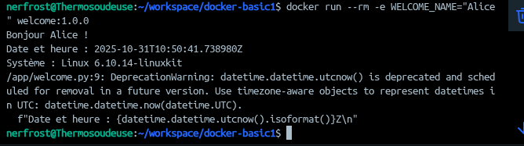

# TP2-Docker
## etape 1

## Etape 2

## Etape 3

## Etape 4

docker build -t welcome:1.0.0 .
docker run --rm -e WELCOME_NAME="Alice" welcome:1.0.0
docker run --rm welcome:1.0.0 python -c "print('Commande override')"

## Etape 5

docker run -d --name welcome_app welcome:1.0.0 sleep 60
docker inspect --format '{{json .Config.Env}}' welcome_app | python -m json.tool
docker logs welcome_app
docker top welcome_app
docker stop welcome_app && docker rm welcome_app
docker system df
docker image prune -f